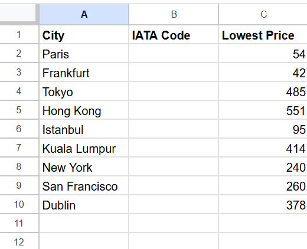

# CHEAP FLIGHT SMS ALERT
# This project is created using Python 3.12 and Pycharm

**Prerequisite**
- Object Oriented Programming
- Knows how to use API especially Amadeus API,  Twilio API, and Sheety API(For reading and writing google sheets)

**Steps to run the project**
1. Install python 3.12
2. Install module requests and twilio.rest
3. Create an account on https://sheety.co/
4. Craete an account on https://developers.amadeus.com/
5. Create an account on Twilio (https://www.twilio.com/docs/usage/api)

# Usage Guide
1. Create a google sheet in the given format and connect it to sheety.

    The price in sheet is GBP (Pounds)
    You can give prices in any currency supported by Amadeus(see [Amadeus API Documentation](https://developers.amadeus.com/self-service/category/flights/api-doc/flight-offers-search/api-reference)). Make sure to change currency_code in flight_search.py at line 67. 

2. Write down the threshold prices of the destination in lowest price column of the sheet.
3. Add your sheety API endpoint to data_manager.py at line 7.
4. Add your Amadeus, Sheety and Twilio credentials to .env file of the project.
5. Add the IATA code of your ORIGIN CITY (from where you want to search the flights) in main.py at line 16
6. This program search for the cheap flights from your given IATA code to the destinations in google sheet upto six months from tommorow.
7. If the price of the flight is below your given price in the google sheet than you will recieve a SMS with origin_airport, destination_airport, out_date, return_date

### Created by AQIB ALI